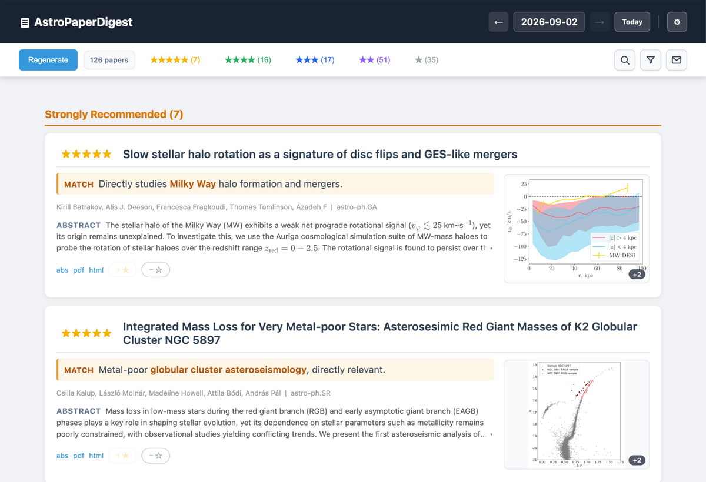

# Astro Digest

[中文](README_zh.md)

Your daily astrophysics reading list, ranked by how closely each paper matches your research interests.

## What it does

- Ranks papers from arXiv with 1–5 stars and a short recommendation reason.
- Shows figure previews and galleries for 4–5 star papers in a macOS desktop app.
- Uses your keywords or local Zotero library to personalize recommendations, with optional daily email.

## Get started

1. Download the latest **DMG** from [Releases](https://github.com/jiangrz77/AstroDigest/releases/latest) and drag the app into **Applications**.
2. Open the app and set up your API key and research interests.
3. Browse your daily digest; use Settings to adjust your profile or enable email.

Requires macOS and a DeepSeek or other OpenAI-compatible API key. The DMG includes Python.

If macOS blocks the first launch, use **System Settings → Privacy & Security → Open Anyway**.

## More

[User guide](docs/usage.md) · [Source installation](docs/usage.md#installation) · [Maintainer guide](docs/maintaining.md)

Thank you to arXiv for use of its open access interoperability.

[MIT License](AstroDigest/LICENSE)
